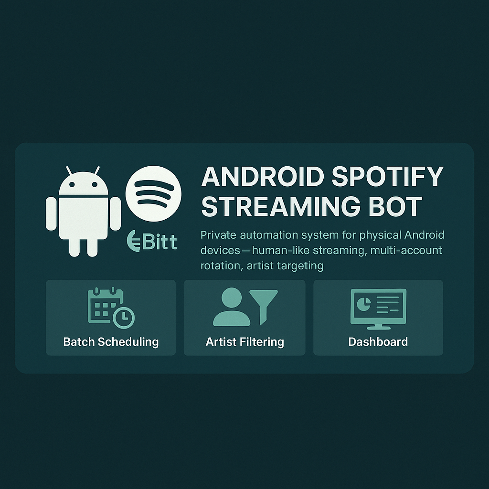
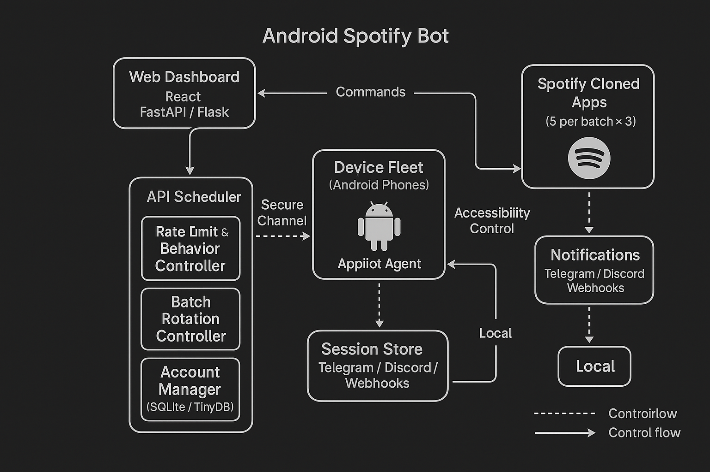
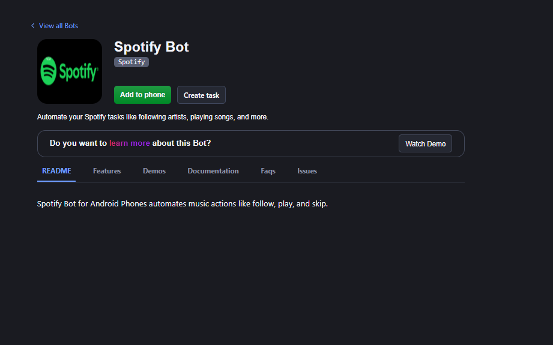
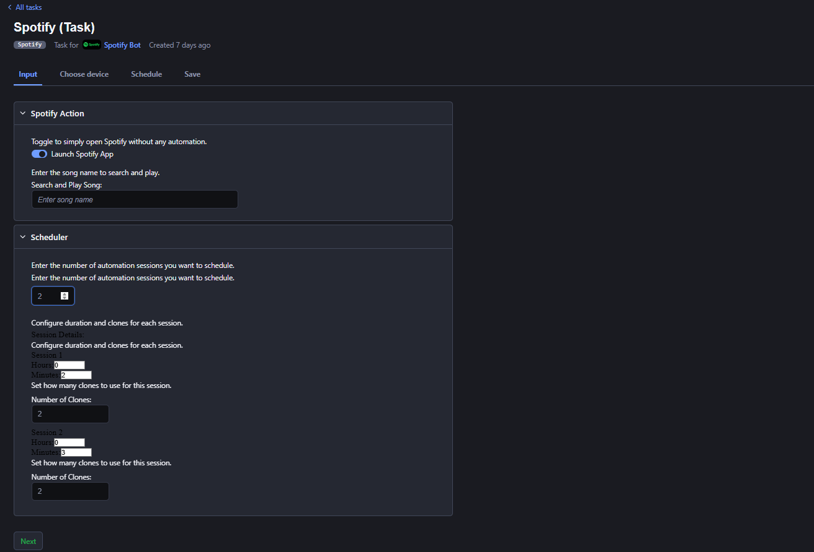
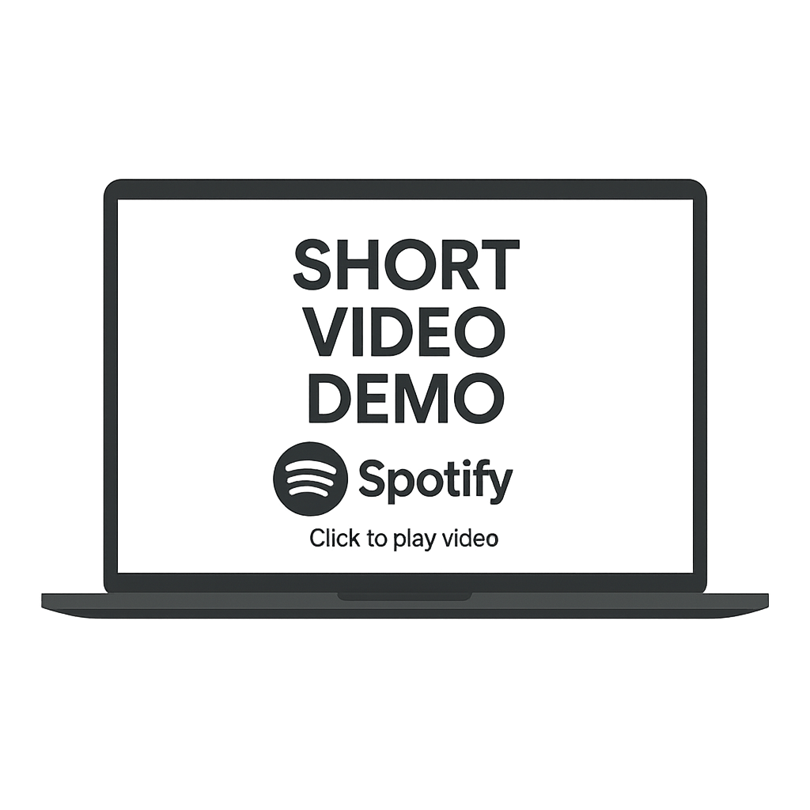

# Spotify Streaming Bot (Android) — Playback & Playlist Automation (Private)

> **enterprise-grade _spotify streaming bot_** for **physical Android devices**.  
> Designed for labels, artists, and operations teams: human-like **playback automation**, **multi-account rotation**, artist/playlist targeting, and centralized control via a **web dashboard**.  
> *(spotify streaming bot · spotify play bot · spotify streaming automation · spotify playlist automation bot · spotify api playback bot)*

---

## Features
- **Batch Scheduling** — Run **3×8h rotations** (e.g., 5 accounts per batch) with automatic hand-off.  
- **Session Persistence** — Stable login state; auto-recovery after reboots.  
- **Daily Stream Limits** — Per-song / per-account caps; respectful **rate-limit-aware** logic.  
- **Randomized Saves** — Configurable probability to save tracks for natural patterns.  
- **Artist/Playlist Targeting** — Prefer a target artist via radio/search heuristics; flexible **playlist automation**.  
- **Cloned Spotify APKs** — Unique app IDs + tuned fingerprints per instance.  
- **Dashboard Management** — Start/stop batches, set rules, monitor activity, export logs.  
- **Notifications** — Optional Telegram/Discord alerts for status and errors.  
- **Scale-Out** — Built for **phone-farms** (real devices; no emulator required).  

> Engine: Android Accessibility/UI automation with tap/scroll/gesture simulation and smart delay jitter.

---

## Screens & Demo

  

## Architecture (High-Level)

  

## Dashboard

  

## Batch Scheduler

  

---

## 🎥 Video Demo

  

**Full Walkthroughs:**
- Part 1 — https://www.loom.com/share/ba19ddc5d0594c48a4321f0bf517227d?sid=4fe5594f-eecd-4209-ad2d-2588c42ccd2d  
- Part 2 — https://www.loom.com/share/788a03a5c2bf4044b96d54517a5915d1?sid=a9f598d5-3641-46bf-ba6f-145c9bb5f10f  

---

## Why Choose This Bot?
- **24/7 Streaming Automation** — Three batches/day per device for continuous rotation.  
- **Human-Like Behavior** — Swipes, taps, scrolls, volume nudges, random waits (**safe pacing**).  
- **Artist Targeting** — Filter by artist/playlist; supports artist radio flows.  
- **Multi-Account Scaling** — ~15 accounts/device using cloned, fingerprint-tuned apps.  
- **Full Control** — Web dashboard to configure rules, start/stop, and view logs in real time.

---

## How It Works (High-Level)
1. **Connect Devices & Accounts** — Install device agent and add Spotify accounts.  
2. **Set Behavior Rules** — Artist filters, per-song caps, save %, delays.  
3. **Start Batches** — **3×8h** rotation with automatic account switching.  
4. **Monitor & Adjust** — Dashboard for status, logs, alerts, and quick edits.

> Default strategies favor conservative behavior: randomized delays, per-account limits, and robust recovery.

---

## Tech Overview
- **Platform:** Physical Android (8.0+), phone-farm friendly.  
- **Control:** Web dashboard (backend API + React UI) with device agents.  
- **Automation:** Android Accessibility/UI Automator with touch injection.  
- **Data:** Local DB for sessions, counters, and scheduling metadata.  
- **Integrations:** CSV/Sheets import; optional webhooks/alerts.

---

## Compliance & Responsibility
- **Use only with accounts you own or have explicit permission to manage.**  
- Respect **Spotify’s Terms** and applicable laws; do **not** use this project to manipulate streams or metrics.  
- Some actions (e.g., API playback control) require **Spotify Premium** and **user consent (OAuth)**.  

---

## Access & Onboarding
This is a **private binary** with guided onboarding. Share your use case and scale:

- [Join Discord](https://discord.gg/vBu9huKBvy)  
- [Message on Telegram](https://t.me/devpilot1)
- [Visit the Website](https://appilot123.github.io/Spotify-Streaming-Bot/)

> Pricing and licensing are discussed during a call based on device count, support needs, and SLAs.

---

## Contact
  

<!-- SEO helpers (don’t overuse; keep natural in copy above)
spotify streaming bot, spotify stream bot, spotify play bot, spotify streaming automation, spotify playlist automation bot, spotify api playback bot
-->
